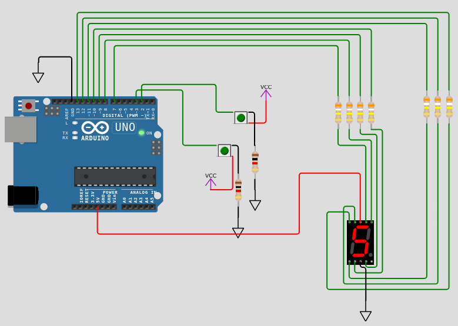
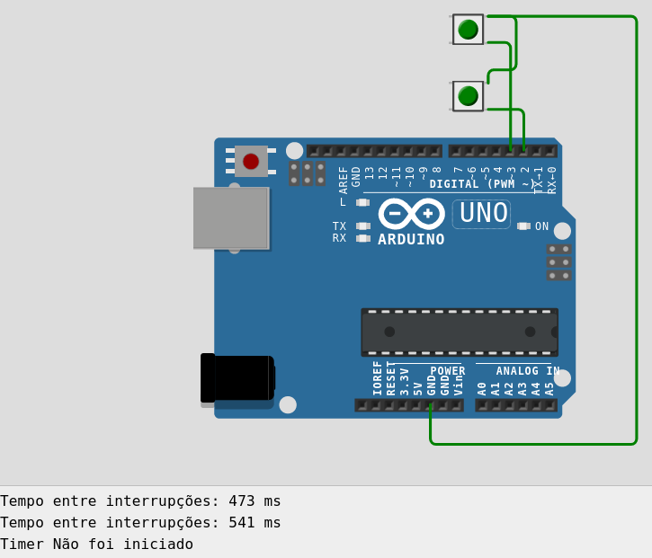

# Relatório da Atividade 3

## Exercício 1

Este [exercício](https://wokwi.com/projects/395341524393549825)   consiste  em um arduino UNO com 2 "*pushbuttons*", e um display de 7 seguimentos. Sempre que o botão de cima é acionado, o contador, mostrado no diplay de 7 seguimentos é incrementado. Sempre que o botão de baixo é apertado, o contador é decrementado.





No código, é utilizada uma matriz para determinar quais pinos, de 7 a 13, devem ser ligados para representar cada número. É a função **display(int num)** que é responsável por fazer o número correto ser apresentado no **Display de 7 seguimentos**. Esta função é usada no *loop()* enquanto ele for executado. Ela, nesse caso, sempre mostra o valor de *count*.

O que altera este valor são as interrupções que estão ligadas aos botões dos pinos 2, e 3, respectivamente responsáveis por eecutar as funções de incremento, e decremento do contador. Além de ser mostrado no display, o valor do *cont* é escrito no *serial monitor* sempre que ele é alterado.

```cpp
int matriz_7seg[10][7] = {
  
    {0, 0, 0, 0, 0, 0, 1}, // 0
    {1, 0, 0, 1, 1, 1, 1}, // 1
    {0, 0, 1, 0, 0, 1, 0}, // 2
    {0, 0, 0, 0, 1, 1, 0}, // 3
    {1, 0, 0, 1, 1, 0, 0}, // 4
    {0, 1, 0, 0, 1, 0, 0}, // 5
    {0, 1, 0, 0, 0, 0, 0}, // 6
    {0, 0, 0, 1, 1, 1, 1}, // 7
    {0, 0, 0, 0, 0, 0, 0}, // 8
    {0, 0, 0, 0, 1, 0, 0}  // 9 
    
};

volatile int count = 0;

void display(int num) {
    int i = 0, pin = 7; // we start at pin 7
    while (i < 7) {
        digitalWrite(pin, matriz_7seg[num][i]);
        i++;
        pin++;
    }
}

void increment() {
    count++;
    if (count > 9) {
        count = 0;
    }
    Serial.print(count);
    Serial.println();
}

void decrement() {
    count--;
    if (count < 0) {
        count = 9;
    }
    Serial.print(count);
    Serial.println();
}

void setup() {
    Serial.begin(9600);
    int i = 7; // we start at pin 7
    while (i < 14) {
        pinMode(i, OUTPUT);
        i++;
    }
    pinMode(2, INPUT);
    pinMode(3, INPUT);
    attachInterrupt(digitalPinToInterrupt(2), increment, RISING);
    attachInterrupt(digitalPinToInterrupt(3), decrement, RISING);
}

void loop() {
  
  display(count);  
  
}


```


## Execício 2

Este [exercício](https://wokwi.com/projects/395526943037631489) consiste em um arduino UNO e dois botões, sendo o de baixo responsável por iniciar uma contagem de tempo, e o de cima por terminá-la. Os resultados da contagem de tempo são impressos no *serial monitor* do arduino, como é mostrado na figura abaixo. Caso o botão de parada seja acionado antes do de início, é impressa a mensagem que indica que o timer não foi iniciado.




O código é bem simples. Consiste apenas no *setup* dos botões e nas interrupçẽs de início e fim do temporizador. Os tempos de início e fim são marcados com a função *millis()*, e a função *finishTimer()* só calcula o tempo se a variável *finished* for *false*, indicando que o timer foi iniciado, e não finalizado. A função *loop()* permanesce vazia. Este código é orientado a interrupções.

```cpp
volatile unsigned long startTime = 0;
volatile unsigned long endTime = 0;
volatile boolean finished = false;

void setup() {
  
  Serial.begin(9600);
  
  pinMode(2, INPUT_PULLUP);
  pinMode(3, INPUT_PULLUP);
  
  attachInterrupt(digitalPinToInterrupt(2), interruptHandler, FALLING);
  attachInterrupt(digitalPinToInterrupt(3), finishTimer, FALLING);
}

void loop() {
}

void interruptHandler() {
    startTime = millis(); 
    finished = false;
}


void finishTimer(){
    if(finished == false){
      endTime = millis(); 
      unsigned long elapsedTime = endTime - startTime;
      Serial.print("Tempo entre interrupções: ");
      Serial.print(elapsedTime);
      Serial.println(" ms");
      finished = true;
    }else{
      Serial.println("Timer Não foi iniciado");
    }
}


```


## Exercício 3

Para este [exercício](https://wokwi.com/projects/395504377803864065), foram usados um arduino UNO, dois botões, para ligar e desligar o alarme, e um *Buzzer* e uma LED para funcionarem como alarme.


Neste exercício, as funções de interrupção foram usadas soomente para alterar valores das variáveis globais *alarmOn* e *cancelAlarm* que são usadas no *loop()* para decidir se o alarme fica ligado, ou desligado.

Os botões estão setados como *INPUT PULL UP* pra garantir a estabilidade, ou seja, pra garantir que os botões cumpram sua funções sempre que forem pressionados.


```cpp


// Definir os pinos
const int sensorPin = 2; // Pino do sensor de movimento
const int cancelPin = 3; // Pino do botão de cancelamento
const int ledPin = 13;    // Pino do LED
const int buzzerPin = 12; // Pino do buzzer

// Variáveis para controlar o estado do alarme e o cancelamento
volatile bool alarmOn = false;
volatile bool cancelAlarm = false;

void setup() {
  pinMode(sensorPin, INPUT_PULLUP);
  pinMode(cancelPin, INPUT_PULLUP);
  pinMode(ledPin, OUTPUT);
  pinMode(buzzerPin, OUTPUT);
  Serial.begin(9600);

  // Configurar as interrupções
  attachInterrupt(digitalPinToInterrupt(sensorPin), alarmISR, FALLING);
  attachInterrupt(digitalPinToInterrupt(cancelPin), cancelISR, FALLING);
}

void loop() {
  if (alarmOn) {
    digitalWrite(ledPin, HIGH);
    tone(buzzerPin, 1000); // Emitir um som
    delay(500); // Tempo para o som
    noTone(buzzerPin); // Parar o som
    delay(500); // Tempo sem som
  } else {
    digitalWrite(ledPin, LOW);
    noTone(buzzerPin); // Garantir que o som está desligado
  }

  // Se o alarme foi cancelado, desligue o alarme
  if (cancelAlarm) {
    alarmOn = false;
    cancelAlarm = false;
  }
}

// Função de interrupção para ligar o alarme
void alarmISR() {
  Serial.println("Start");
  alarmOn = true;
}

// Função de interrupção para cancelar o alarme
void cancelISR() {
  Serial.println("Cancel");
  cancelAlarm = true;
}

```


## Exercício 4

Este [exercício](https://wokwi.com/projects/395532006723765249) é, basicamente um aprimoramento do eercício anterior. Ao invés de um botão ligar o alarme, e o outro desligar. O botão ligado ao pino 2 liga, e desliga o alarme, ao passo que o botão do pino 3 é responsável pela função de soneca do alarme, caso ele seja pressionado quando o alarme estiver ligado.


De modo semelhante ao exercício anterior, a lógica de funcionamento é implementada no *loop()* e as interrupções apenas determinam os valores das variáveis globais que são usadas para determinar quanto temṕo o alarme fica em soneca, se ele está em modo soneca, e por quanto tempo ele deve permanescer ligado, se ninguém o desligar.


```cpp
// Definir os pinos
const int alarmPin = 2; // Pino do botão para disparar o alarme
const int snoozePin = 3; // Pino do botão para ativar a função soneca
const int buzzerPin = 4; // Pino do buzzer
const int ledPin = 7; // Pino do LED de indicação

// Variáveis para controlar o estado do alarme e da soneca
bool alarmOn = false;
bool snoozeActive = false;
unsigned long lastTriggerTime = 0;
const unsigned long snoozeTime = 30000; // Tempo em milissegundos para a soneca (1 minuto)
const unsigned long alarmDuration = 10000; // Tempo em milissegundos para desligar o alarme automaticamente (30 segundos)

void setup() {
  pinMode(alarmPin, INPUT_PULLUP);
  pinMode(snoozePin, INPUT_PULLUP);
  pinMode(buzzerPin, OUTPUT);
  pinMode(ledPin, OUTPUT);
  
  // Iniciar com o LED desligado
  digitalWrite(ledPin, LOW);

  // Attach interrupts
  attachInterrupt(digitalPinToInterrupt(alarmPin), triggerAlarm, FALLING);
  attachInterrupt(digitalPinToInterrupt(snoozePin), activateSnooze, FALLING);
}

void loop() {
  if (alarmOn) {
    // Emitir som do alarme
    tone(buzzerPin, 1000);
    digitalWrite(ledPin, HIGH);

    // Verificar se a função soneca está ativa
    if (snoozeActive) {
      // Ativar a soneca
      noTone(buzzerPin);
      digitalWrite(ledPin, LOW);
      delay(snoozeTime);
      alarmOn= true;
      snoozeActive = false;
      tone(buzzerPin, 1000);
      digitalWrite(ledPin, HIGH);
      lastTriggerTime = millis(); // Resetar o tempo do último disparo
    } else {
      // Desligar o alarme após o tempo de duração
      if (millis() - lastTriggerTime > alarmDuration) {
        alarmOn = false;
        digitalWrite(ledPin, LOW);
      }
    }
  } else {
    // Se o alarme não estiver ativo, garantir que o buzzer esteja desligado
    noTone(buzzerPin);
    digitalWrite(ledPin, LOW);
  }
}

void triggerAlarm() {
  // Disparar o alarme
  alarmOn = !alarmOn;
  lastTriggerTime = millis();
}

void activateSnooze() {
  // Ativar a função soneca
  snoozeActive = true;
}

```
