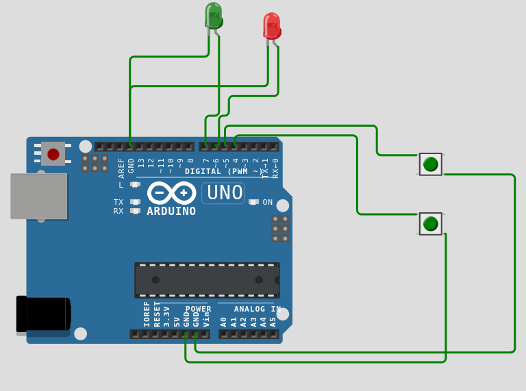
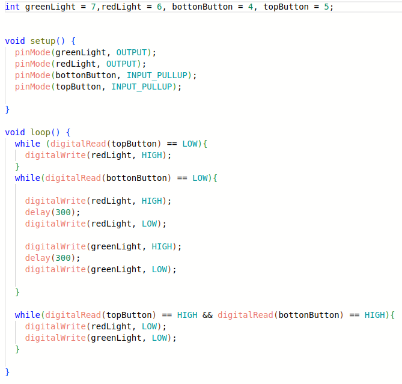
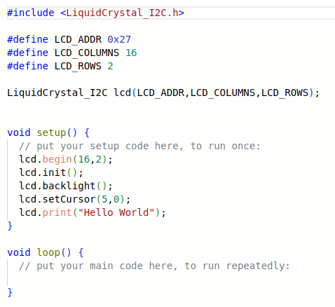
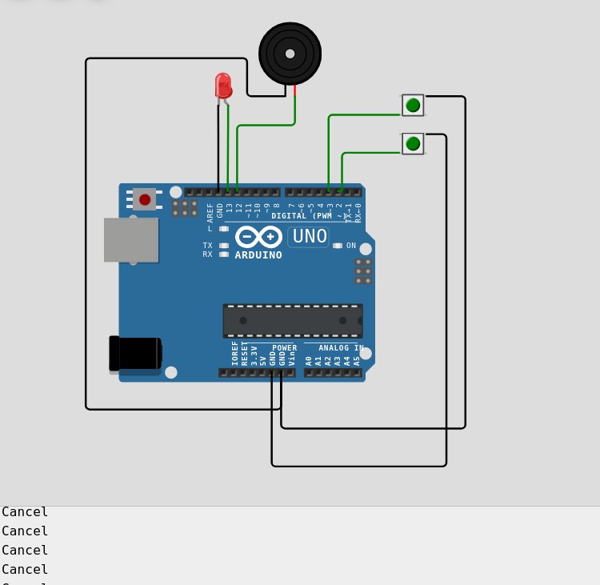
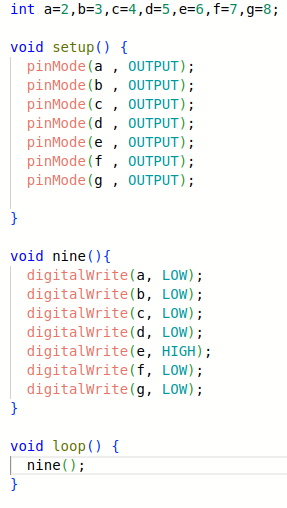
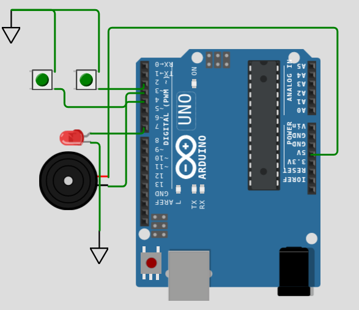
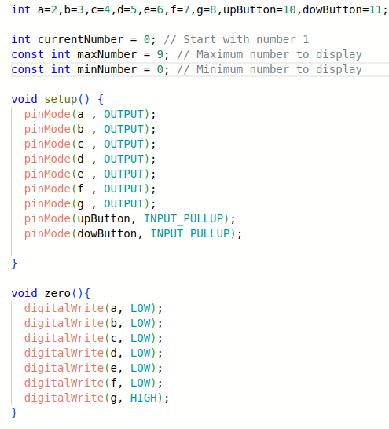
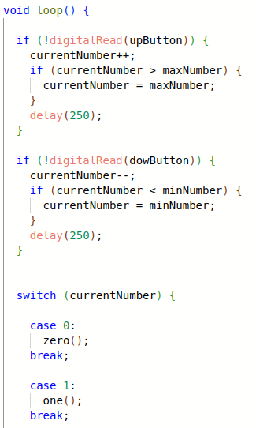

# Relatório da Atividade 2

## Exercício 1

Este exercício consiste simplesmente em um arduino UNO com 2 LEDs e dois botões, o *top button* e o *bottom button*, como são chamados no código do [exercício no wokwi](https://wokwi.com/projects/394438792120935425). O arduino controla os dois leds da seguinte forma: Os dois botões são usados em modo PULL UP, o que significa que, caso pressionados, o sinal que chega para as entradas dos ledes é zero, caso eles sejam apertados. Enquanto o *botton button* é pressionado, on LED vermelho ascende, já enquanto o *top button é pressionado*, os dois leds ficam piscando alternadamente.

A imagem a seguir mostra o circúito feito no simulador. A saida **1.l** do *top button* é ligada na **entrada digital 5** do Arduino UNO, a saida **1.l** do *botton button*, na **entrada digital 4**. Já as saídas **2.r** dos dois botões são ligadas ao ***Ground***, ou seja, recebem o **sinal lógico 0**.
As LEDs, por sua vez, tem seus catpodos ligados ao *Ground*, o anodo do LED vermelho é conectado à **entrada 6**, e o do verde, **à entrada 7**.

A próxima omagem mostra o código propriamente dito. Nele, são dados nomes característicos para as entradas digitais, de acordo com os dispositivos ligados nelas. Os botões são setados como **inputs do tipo pull up**, e os LEDs, como **outputs**. Inicialmente, os LEDs estão apagados. Quando o *top button* é pressionado, o nível lógico da porta 5 é lido zero, e a porta 6, da LED vermelha, é setado como *HIGHT*, o que faz a luz vermelha ascender. Se o *bottom button* é pressionado, a porta 6 fica em nível alto por 300 ms, depois a porta 7, e as duas ficam se alternando. Caso nenhum dos botões esteja ativado, ambas as LEDs se apagam. 

## Execício 2

Este [exercício](https://wokwi.com/projects/394445390046628865) consiste em escrever *Hello World* em um display, usando o Arduino UNO.
Para isso, foi utilizado o *wokwi-lcd2004*. O pino *VCC* do display foi ligado na fonte de 5V do arduino, o *Ground* do display foi ligado ao *Ground* do UNO, e seus pinos SDA e SCL foram ligados, respectivamente, às entradas A4 e A5 do arduino. A imagem abaixo mostra o simulador funcionando.

Quanto ao código, foi utilizada a biblioteca ***LiquidCrystal_I2C.h***, para se criar um objeto **lcd**, ligar a luz de fundo do *display*, meramente por aparência, depois, a função **print**, do objeto **lcd**, é usada para printar, na tela do *display*, a frase *Helo World*.

## Exercício 3

Para este [exercício](https://wokwi.com/projects/394444628106182657), os pinos 2, a 8 do arduino UNO foram ligados aos pinos do display de 7 seguimentos, correspondentes aos segumentos de a a g, respectivamente. Não foi possível usar os pinos 0, e 1, provavelmente por eles serem de RX e TX, ou seja, terem funções específicas. O segmento também foi ligado à fonte de tensão de 5V do arduino, para que pudesse funcionar. A figura a seguir mostra o circuito.

O código do exercício, mostrado a seguir, consiste em setar os pinos de 2 a 7 como as variáveis do tipo OUTPUT a a g. Depois é criada a função *nine()*, responsável por setar os níveis lógicos das variáveis de modo que o display mostre o número 9.

## Exercício 4

Este [exercício](https://wokwi.com/projects/394449591727510529) consiste em um aprimoramento do exercício anterior. A diferença, no circuito é o acrescimo de 2 botões, o *top buttom* e o *bottom button* . Ambos tem sua entrada **1.r** ligada ao *Ground*. Suas entradas **2.l** estão ligadas, respectivamente aos pinos 10 e 11 do arduino UNO.  

Quanto ao código, além das variáveis a a g,são criadas as variáveis *upButton* e *dowButton*, que representão os pinos 10 e 11, respectivamente. Essas variáveis são setadas como inputs do tipo **PULL UP**. Além disso, são criadas funções para fazer o display mostrar todos os números de 1 a 9. Também são criadas as variáveis *currentNumber*,*maxNumber* e *minNumber*, que são usadas para se programar o circuito de modo que o botão de cima, caso pressionado, incremente o número mostrado, e o botão de baixo o decremente.

Na função *loop()*, se o botão de cima for pressionado, o sinal lógico de *upButton* é lido como zero, e o valor de *currentNumber* é incrementado. Caso este valor seja maior que 9, ele passa a ser 9; caso o valor seja menor  que zero, ele volta a ser 0. O delay no código é pr evitar que uma pressionada rápida no botão leve a mudnças rápidas demais para o olho humano acompanhar.

